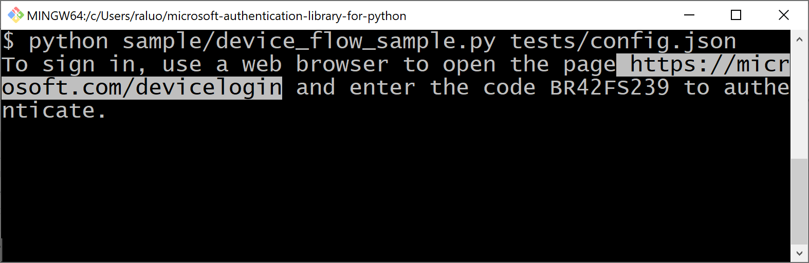
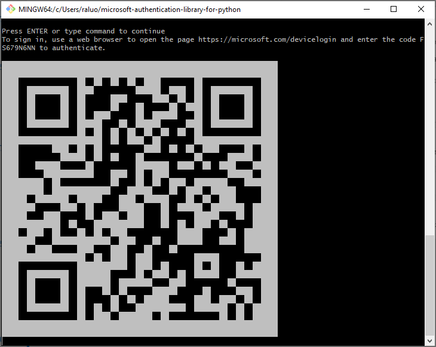

# DS - an oauth2 **D**evice flow **S**pringboard

## The Problem



Sometimes an end user would want to run scripts inside a command line (CLI) environment, such as a remote ssh terminal.
Because those CLI terminal itself does not have browser ability to support rich UI to perform modern password-less sign in,
the typical solution is to use a procedure named Device Flow,
which requires end user to either copy&paste or read&type TWO pieces of information,
a somewhat lengthy URL like `https://your_service_provider.example.com/devicelogin` and a random code like `A1B2C3D4E5`.
You can see this status quo in action from
[this part of pre-existing video](https://www.youtube.com/embed/Q3kx4cmRkCA?start=292&end=334).

Such process is sub-optimal:

* Copying information from a CLI terminal is not always precise,
  especially when the long url happens to be wrapped/splitted by the boundary of the window;
* Read&type are inconvenient and error-prone.
  Imagine an end user misread an `S` as `5`, or `O(oh)` as `0(zero)`,
  he will then need to squint :eyes: and debug.
* And end user would need to switch back-and-forth between the CLI terminal and the browser, twice.
 

## The Proposal

Introducing the Device Flow as a QR Code hack!
The sign-in session will be initialized by a QR code printed in a CLI terminal.
End user would just need to use his/her smart phone and scan the QR code,
and then he/she will finish the sign in inside his/her phone as usual,
without copy&paste or typing those extra entrance url nor a random code!



## The Recipe

In order for this hack to work for your end users, you the app developer would need 2 ingredients.

1. Your Identity Provider (IdP) would need to support grabbing the user code from URL parameter,
   without end user interaction. Not all IdP supports that, and that's what this project can help.
   It provides a springboard web service to accept user code from URL parameter, 
   and then automatically submit it to the real IdP.

   The best part? You do NOT have to clone this project and host it elsewhere.
   It is [already hosted on github](https://rayluo.github.io/ds), for free!
   And I'll also maintain it when those IdPs change their sign in web form parameters.
   But please do click the "Watch" botton of this github repo to receive future upgrade announcements.

   Currently this project provides [a springboard to Microsoft Identity platform](https://rayluo.github.io/ds/ms).
   And more can be easily added upon request.

2. Your app would need to be able to generate a QR code to contain this springboard url and the user code,
   and - this is the tricky part - to render the QR code as text inside the terminal.
   This part is language dependent, but if you happen to be using Python, it turns out to be extremely easy:

   ```python
   import pyqrcode  # You need to do "pip install pyqrcode" beforehand
   user_code = "A1B2C3D4 (somehow got it from your OAuth2 library)"
   print(pyqrcode.create(
       "https://rayluo.github.io/ds/ms?c=%s" % user_code,  # For Microsoft Identity
       ).terminal())
   ```
